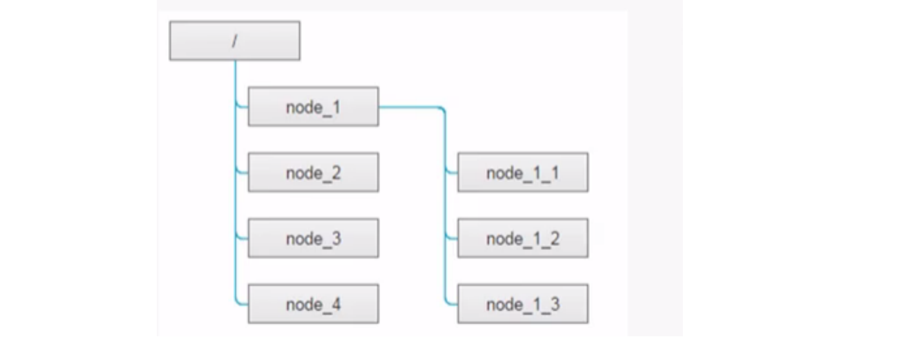

# 分布式网络通信框架RPC

---

RPC：远程过程调用Remote Procedure Call Protocal

C++实现轻量级RPC分布式网络通信框架：https://blog.csdn.net/asdfadafd/article/details/126801651

### 1.技术点

1. 集群与分布式理论
2. RPC远程过程调用原理以及实现
3. 数据序列化与反序列化：Protobuf
4. 服务注册中心：Zookeeper分布式一致性协调服务
5. 网络库编程：muduo
6. conf配置文件读取
7. cmake构建项目集成编译环境

### 2.集群与分布式

- 集群：每台服务器独立运行工程项目的所有模块
- 分布式：工程项目被拆分多个模块，每个模块独立部署运行到一个服务器主机上，所有服务器协同工作共同提供服务。每台服务器称为分布式的一个结点，根据结点的并发要求，可对结点再做结点模块集群部署。


- 黄色部分（序列化/反序列化）：设计rpc方法参数的打包和解析，即数据的序列化和反序列化，利用protobuf实现
- 绿色部分（数据传输网络部分）：网络部分，包括寻找rpc服务主机，发起rpc调用请求和响应rpc调用结果，使用netty网络库。

### 3.网络IO模型

1. accpet + read/write

2. accept + fork（process pre connection）

3. accept + thread（thread pre connection）

4. muduo：reactors in threads（one loop per thread）

   主反应堆负责accept连接然后分发到多个sub reactor中，该连接的所有操作都在sub reactor所处的线程中完成，多个连接可能被分派到多个线程中，以充分利用CPU资源。

5. nginx：reactors in process（one loop per process）

   nginx服务器的网络模块基于进程设计，采用多个Reactors充当IO进程和工作进程，通过accept锁解决多个Reactors的惊群现象。

### 4.第三方框架/工具

#### protobuff

protocal buffer是google的一种数据交换格式，其独立于平台语言。google提供了protobuff多种语言的实现：java、c#、c++、go以及python，每种实现都包含了相应语言的编译器以及库文件。

由于其为二进制格式，比使用xml\Json等格式进行数据交换快许多，可以将其用于分布式应用之间的数据通信或者，异构环境下的数据交换。作为一种效率和兼容性都非常优秀的二进制数据传输格式，可以用于诸如网络传输、配置文件、数据存储等诸多领域。

安装流程：

```shell
# 解压源码
unzip protobuf-master.zip
# 安装所需的工具
cd protobuf-master
sudo apt-get install autoconf automake libtool curl make g++ unzip
# 自动生成configure配置文件
./autogen.sh
# 配置环境
./configure
# 编译源代码并安装
make
sudo make install
# 刷新动态库
sudo ldconfig
```

安装多个版本的protobuf：

```shell
# 下载源码并安装 protobuf 2.x
# protoc2 安装在 /opt/protobuf2/bin/protoc
wget https://github.com/protocolbuffers/protobuf/releases/download/v2.6.1/protobuf-2.6.1.tar.gz
tar -xzf protobuf-2.6.1.tar.gz
cd protobuf-2.6.1
./configure --prefix=/opt/protobuf2
make -j$(nproc)
sudo make install
# 下载并安装 protobuf 3.x
# protoc3 安装在 /opt/protobuf3/bin/protoc
wget https://github.com/protocolbuffers/protobuf/releases/download/v3.20.3/protobuf-cpp-3.20.3.tar.gz
tar -xzf protobuf-cpp-3.20.3.tar.gz
cd protobuf-3.20.3
./configure --prefix=/opt/protobuf3
make -j$(nproc)
sudo make install
# 切换使用版本
# 临时切换
export PATH=/opt/protobuf2/bin:$PATH   # 使用 protoc 2.x
export PATH=/opt/protobuf3/bin:$PATH   # 使用 protoc 3.x
# 永久切换，可以写到 ~/.bashrc
# 或者用 update-alternatives：同时管理多个版本的 protoc
sudo update-alternatives --install /usr/bin/protoc protoc /opt/protobuf2/bin/protoc 20
sudo update-alternatives --install /usr/bin/protoc protoc /opt/protobuf3/bin/protoc 30
sudo update-alternatives --config protoc
```

```
wget https://github.com/protocolbuffers/protobuf/releases/download/v3.20.3/protobuf-cpp-3.20.3.tar.gz
tar -xzf protobuf-cpp-3.20.3.tar.gz
cd protobuf-3.20.3
./configure --prefix=/opt/protobuf3
make -j$(nproc)
sudo make install
```


#### zookeeper

Zookeeper在分布式环境中应用十分广泛，其优秀的功能很多，如分布式环境中全局命名服务注册中心，全局分布式锁等。参考：https://www.cnblogs.com/xinyonghu/p/11031729.html

几个问题：

1. zk的数据是如何组织的？znode节点
2. zk的watcher机制？

```shell
# 解压源码
unzip zookeeper-3.4.10.tar.gz
# 配置文件
cd conf
mv zoo_sample.cfg zoo.cfg
# 启动zookeeper
cd bin
./zkServer.sh start
# 通过 netstat 查看 zkServer 的端口
# 在bin目录启动zkClient.sh链接zkServer
# 熟悉zookeeper组织节点
```

zookeeper已经提供了原生的C/C++和JavaAPI开发的接口，需要通过源码编译生成：

```shell
# zk的原生开发api
# 进入解压后的src/c目录下
 sudo ./configure
 sudo make
 sudo make install
```

主要关注zookeeper如何管理节点：创建节点、获取节点，删除节点以及watcher机制的API编程。

znode节点存储格式：



### 5.Protobuff生成代码

#### LoginRequest

```protobuf
message LoginRequest {
    uint32 user_id = 1;
    string pass_word = 2;
}
```

```cpp
class LoginRequest final :
    public ::PROTOBUF_NAMESPACE_ID::Message /* @@protoc_insertion_point(class_definition:fixbug.LoginRequest) */ {
 public:
  inline LoginRequest() : LoginRequest(nullptr) {}
  ~LoginRequest() override;
  explicit PROTOBUF_CONSTEXPR LoginRequest(::PROTOBUF_NAMESPACE_ID::internal::ConstantInitialized);

  LoginRequest(const LoginRequest& from);
  LoginRequest(LoginRequest&& from) noexcept
    : LoginRequest() {
    *this = ::std::move(from);
  }

  inline LoginRequest& operator=(const LoginRequest& from) {
    CopyFrom(from);
    return *this;
  }
  inline LoginRequest& operator=(LoginRequest&& from) noexcept {
    if (this == &from) return *this;
    if (GetOwningArena() == from.GetOwningArena()
  #ifdef PROTOBUF_FORCE_COPY_IN_MOVE
        && GetOwningArena() != nullptr
  #endif  // !PROTOBUF_FORCE_COPY_IN_MOVE
    ) {
      InternalSwap(&from);
    } else {
      CopyFrom(from);
    }
    return *this;
  }

  static const ::PROTOBUF_NAMESPACE_ID::Descriptor* descriptor() {
    return GetDescriptor();
  }
  static const ::PROTOBUF_NAMESPACE_ID::Descriptor* GetDescriptor() {
    return default_instance().GetMetadata().descriptor;
  }
  static const ::PROTOBUF_NAMESPACE_ID::Reflection* GetReflection() {
    return default_instance().GetMetadata().reflection;
  }
  static const LoginRequest& default_instance() {
    return *internal_default_instance();
  }
  static inline const LoginRequest* internal_default_instance() {
    return reinterpret_cast<const LoginRequest*>(
               &_LoginRequest_default_instance_);
  }
  static constexpr int kIndexInFileMessages =
    2;

  friend void swap(LoginRequest& a, LoginRequest& b) {
    a.Swap(&b);
  }
  inline void Swap(LoginRequest* other) {
    if (other == this) return;
  #ifdef PROTOBUF_FORCE_COPY_IN_SWAP
    if (GetOwningArena() != nullptr &&
        GetOwningArena() == other->GetOwningArena()) {
   #else  // PROTOBUF_FORCE_COPY_IN_SWAP
    if (GetOwningArena() == other->GetOwningArena()) {
  #endif  // !PROTOBUF_FORCE_COPY_IN_SWAP
      InternalSwap(other);
    } else {
      ::PROTOBUF_NAMESPACE_ID::internal::GenericSwap(this, other);
    }
  }
  void UnsafeArenaSwap(LoginRequest* other) {
    if (other == this) return;
    GOOGLE_DCHECK(GetOwningArena() == other->GetOwningArena());
    InternalSwap(other);
  }

  // implements Message ----------------------------------------------

  LoginRequest* New(::PROTOBUF_NAMESPACE_ID::Arena* arena = nullptr) const final {
    return CreateMaybeMessage<LoginRequest>(arena);
  }
  using ::PROTOBUF_NAMESPACE_ID::Message::CopyFrom;
  void CopyFrom(const LoginRequest& from);
  using ::PROTOBUF_NAMESPACE_ID::Message::MergeFrom;
  void MergeFrom(const LoginRequest& from);
  private:
  static void MergeImpl(::PROTOBUF_NAMESPACE_ID::Message* to, const ::PROTOBUF_NAMESPACE_ID::Message& from);
  public:
  PROTOBUF_ATTRIBUTE_REINITIALIZES void Clear() final;
  bool IsInitialized() const final;

  size_t ByteSizeLong() const final;
  const char* _InternalParse(const char* ptr, ::PROTOBUF_NAMESPACE_ID::internal::ParseContext* ctx) final;
  uint8_t* _InternalSerialize(
      uint8_t* target, ::PROTOBUF_NAMESPACE_ID::io::EpsCopyOutputStream* stream) const final;
  int GetCachedSize() const final { return _cached_size_.Get(); }

  private:
  void SharedCtor();
  void SharedDtor();
  void SetCachedSize(int size) const final;
  void InternalSwap(LoginRequest* other);

  private:
  friend class ::PROTOBUF_NAMESPACE_ID::internal::AnyMetadata;
  static ::PROTOBUF_NAMESPACE_ID::StringPiece FullMessageName() {
    return "fixbug.LoginRequest";
  }
  protected:
  explicit LoginRequest(::PROTOBUF_NAMESPACE_ID::Arena* arena,
                       bool is_message_owned = false);
  public:

  static const ClassData _class_data_;
  const ::PROTOBUF_NAMESPACE_ID::Message::ClassData*GetClassData() const final;

  ::PROTOBUF_NAMESPACE_ID::Metadata GetMetadata() const final;

  // nested types ----------------------------------------------------

  // accessors -------------------------------------------------------

  enum : int {
    kPassWordFieldNumber = 2,
    kUserIdFieldNumber = 1,
  };
  // string pass_word = 2;
  void clear_pass_word();
  const std::string& pass_word() const;
  template <typename ArgT0 = const std::string&, typename... ArgT>
  void set_pass_word(ArgT0&& arg0, ArgT... args);
  std::string* mutable_pass_word();
  PROTOBUF_NODISCARD std::string* release_pass_word();
  void set_allocated_pass_word(std::string* pass_word);
  private:
  const std::string& _internal_pass_word() const;
  inline PROTOBUF_ALWAYS_INLINE void _internal_set_pass_word(const std::string& value);
  std::string* _internal_mutable_pass_word();
  public:

  // uint32 user_id = 1;
  void clear_user_id();
  uint32_t user_id() const;
  void set_user_id(uint32_t value);
  private:
  uint32_t _internal_user_id() const;
  void _internal_set_user_id(uint32_t value);
  public:

  // @@protoc_insertion_point(class_scope:fixbug.LoginRequest)
 private:
  class _Internal;

  template <typename T> friend class ::PROTOBUF_NAMESPACE_ID::Arena::InternalHelper;
  typedef void InternalArenaConstructable_;
  typedef void DestructorSkippable_;
  ::PROTOBUF_NAMESPACE_ID::internal::ArenaStringPtr pass_word_;
  uint32_t user_id_;
  mutable ::PROTOBUF_NAMESPACE_ID::internal::CachedSize _cached_size_;
  friend struct ::TableStruct_test_2eproto;
};
```


#### UserSeriviceRpc

```protobuf
service UserSeriviceRpc {
    rpc Login(LoginRequest) returns(LoginResponse);
    rpc GetFriendList(GetFriendListRequest) returns(GetFriendListResponse);
}
```

```cpp
class UserSeriviceRpc_Stub;
class UserSeriviceRpc : public ::PROTOBUF_NAMESPACE_ID::Service {
 protected:
  // This class should be treated as an abstract interface.
  inline UserSeriviceRpc() {};
 public:
  virtual ~UserSeriviceRpc();

  typedef UserSeriviceRpc_Stub Stub;

  static const ::PROTOBUF_NAMESPACE_ID::ServiceDescriptor* descriptor();

  virtual void Login(::PROTOBUF_NAMESPACE_ID::RpcController* controller,
                       const ::fixbug::LoginRequest* request,
                       ::fixbug::LoginResponse* response,
                       ::google::protobuf::Closure* done);
  virtual void GetFriendList(::PROTOBUF_NAMESPACE_ID::RpcController* controller,
                       const ::fixbug::GetFriendListRequest* request,
                       ::fixbug::GetFriendListResponse* response,
                       ::google::protobuf::Closure* done);

  // implements Service ----------------------------------------------

  const ::PROTOBUF_NAMESPACE_ID::ServiceDescriptor* GetDescriptor();  
  void CallMethod(const ::PROTOBUF_NAMESPACE_ID::MethodDescriptor* method,
                  ::PROTOBUF_NAMESPACE_ID::RpcController* controller,
                  const ::PROTOBUF_NAMESPACE_ID::Message* request,
                  ::PROTOBUF_NAMESPACE_ID::Message* response,
                  ::google::protobuf::Closure* done);
  const ::PROTOBUF_NAMESPACE_ID::Message& GetRequestPrototype(
    const ::PROTOBUF_NAMESPACE_ID::MethodDescriptor* method) const;
  const ::PROTOBUF_NAMESPACE_ID::Message& GetResponsePrototype(
    const ::PROTOBUF_NAMESPACE_ID::MethodDescriptor* method) const;

 private:
  GOOGLE_DISALLOW_EVIL_CONSTRUCTORS(UserSeriviceRpc);
};

class UserSeriviceRpc_Stub : public UserSeriviceRpc {
 public:
  UserSeriviceRpc_Stub(::PROTOBUF_NAMESPACE_ID::RpcChannel* channel);
  UserSeriviceRpc_Stub(::PROTOBUF_NAMESPACE_ID::RpcChannel* channel,
                   ::PROTOBUF_NAMESPACE_ID::Service::ChannelOwnership ownership);
  ~UserSeriviceRpc_Stub();

  inline ::PROTOBUF_NAMESPACE_ID::RpcChannel* channel() { return channel_; }

  // implements UserSeriviceRpc ------------------------------------------

  void Login(::PROTOBUF_NAMESPACE_ID::RpcController* controller,
                       const ::fixbug::LoginRequest* request,
                       ::fixbug::LoginResponse* response,
                       ::google::protobuf::Closure* done);
  void GetFriendList(::PROTOBUF_NAMESPACE_ID::RpcController* controller,
                       const ::fixbug::GetFriendListRequest* request,
                       ::fixbug::GetFriendListResponse* response,
                       ::google::protobuf::Closure* done);
 private:
  ::PROTOBUF_NAMESPACE_ID::RpcChannel* channel_;
  bool owns_channel_;
  GOOGLE_DISALLOW_EVIL_CONSTRUCTORS(UserSeriviceRpc_Stub);
};
```

#### RpcChannel

```cpp
// Abstract interface for an RPC channel.  An RpcChannel represents a
// communication line to a Service which can be used to call that Service's
// methods.  The Service may be running on another machine.  Normally, you
// should not call an RpcChannel directly, but instead construct a stub Service
// wrapping it.  Example:
//   RpcChannel* channel = new MyRpcChannel("remotehost.example.com:1234");
//   MyService* service = new MyService::Stub(channel);
//   service->MyMethod(request, &response, callback);
class LIBPROTOBUF_EXPORT RpcChannel {
 public:
  inline RpcChannel() {}
  virtual ~RpcChannel();

  // Call the given method of the remote service.  The signature of this
  // procedure looks the same as Service::CallMethod(), but the requirements
  // are less strict in one important way:  the request and response objects
  // need not be of any specific class as long as their descriptors are
  // method->input_type() and method->output_type().
  virtual void CallMethod(const MethodDescriptor* method,
                          RpcController* controller,
                          const Message* request,
                          Message* response,
                          Closure* done) = 0;

 private:
  GOOGLE_DISALLOW_EVIL_CONSTRUCTORS(RpcChannel);
};
```

### 6.将本地服务发布成PRC服务

通过此框架可以将上层应用的本地方法，快速的部署成PRC方法，框架不处理任何业务。


